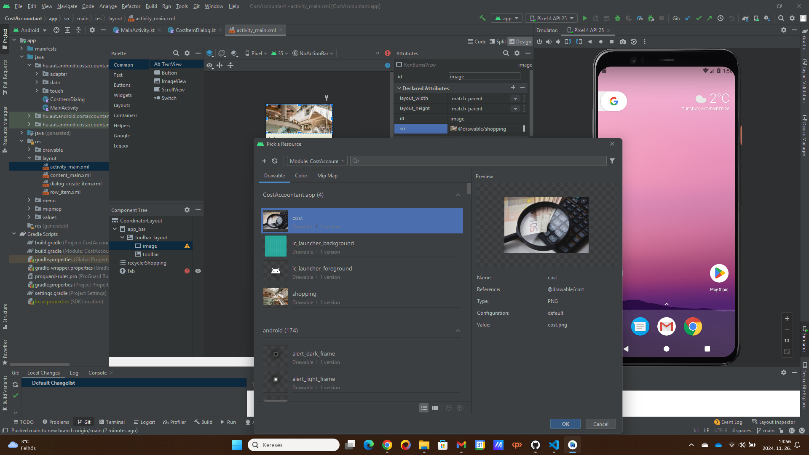
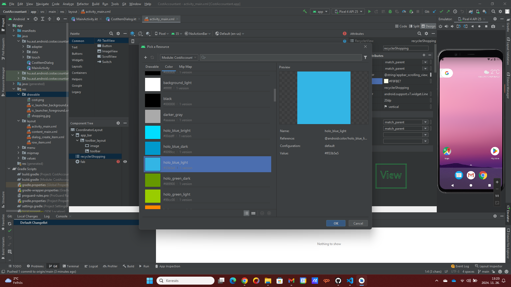
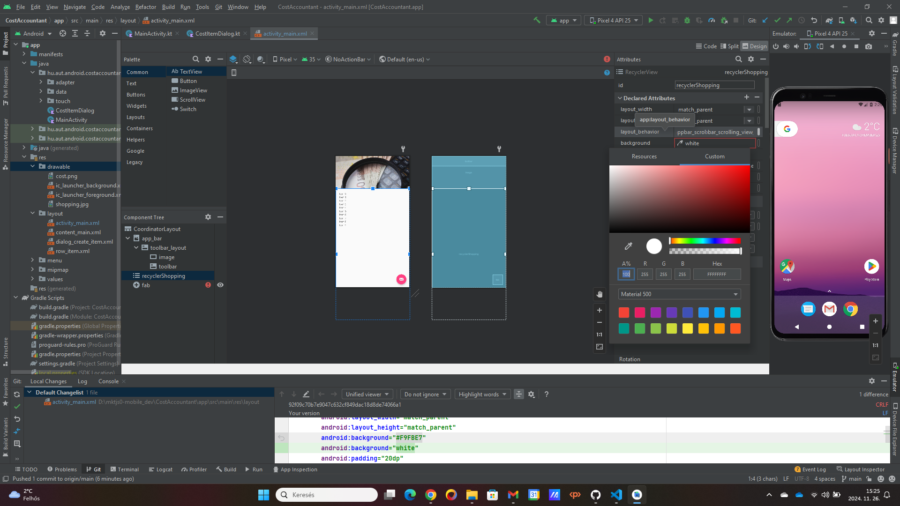

# KotlinShoppingList alkalmazás módosítása

A dokumentáció Markdown fájlként készül el, így a GitHub repositoryban közvetlenül látható lesz. Készül belőle pdf változat is, amely szintén elérhető lesz a GitHub repository címén:

https://github.com/kovacsgergely22/mktjs0-mobile_dev.git

## Csomagnevek és tartalmazó mappa módosítása

Az alkalmazásban először a csomagneveket és a tartalmazó mappa nevét módosítottam a KotlinShoppinglist alkalmazást átneveztem CostAccountant névre.

## Háttérkép módosítása

A következő lépés az alkalmazás felső részében található kép módosítása volt. Mivel költségnyilvántartó applikációra módosítok, így a következő képre esett a választásom (a kép a pixabay.com-ról származik, szabadon felhasználható).


A képet a következő helyre kellett bemásolni, hogy megtörténhessen a módosítás:

```
CostAccountant\app\src\main\res\drawable
```

A változtatást az activity_main.xml fájlban kellett végrehajtani. A folyamatot a következő kép szemlélteti:



## A háttér színének módosítása

A kép alatt található rész háttérszínét kékre változtattam, szintén az activity_main.xml fájlban, ahogy a következő ábra mutatja:



Ezzel a lehetőséggel az alapértelmezetten elérhető színek között választhatunk. Ezek közül egyik sem tetszett, ezért a színkeverő lehetőséget alkalmaztam.

