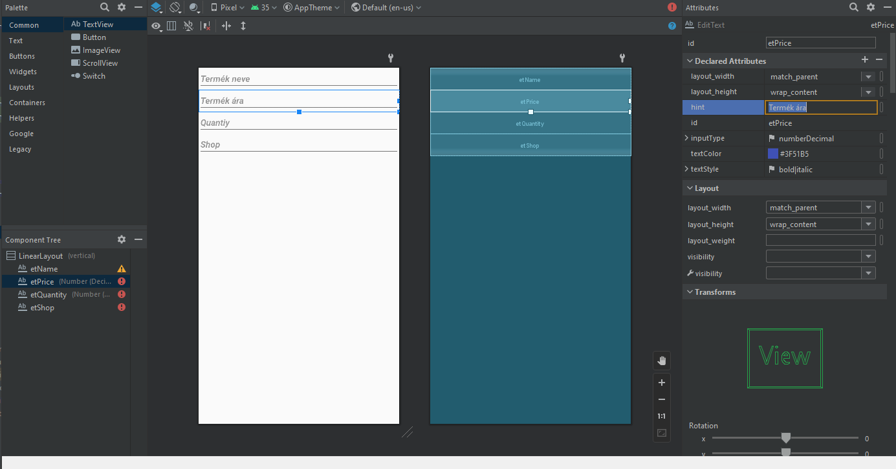
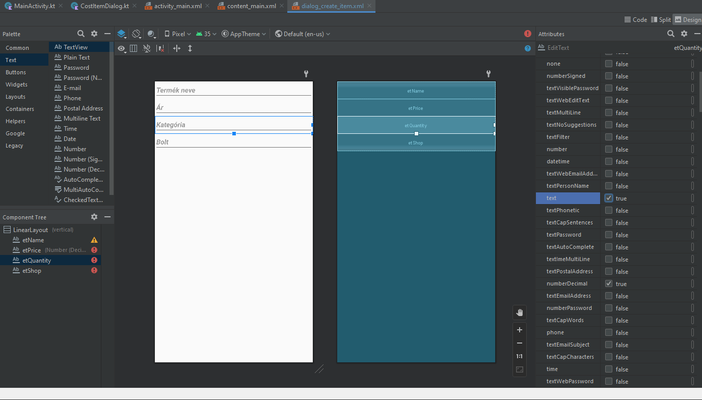
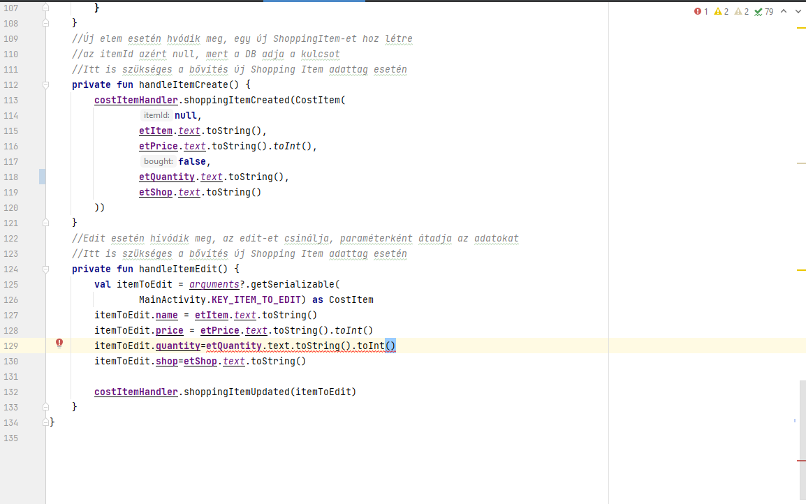
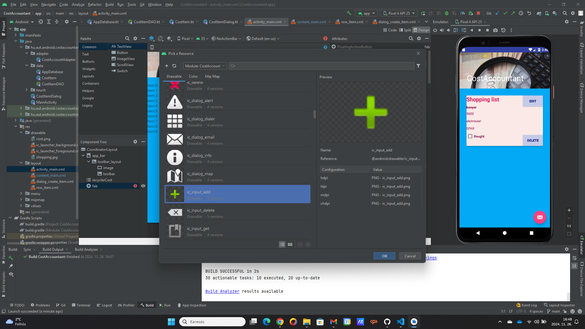
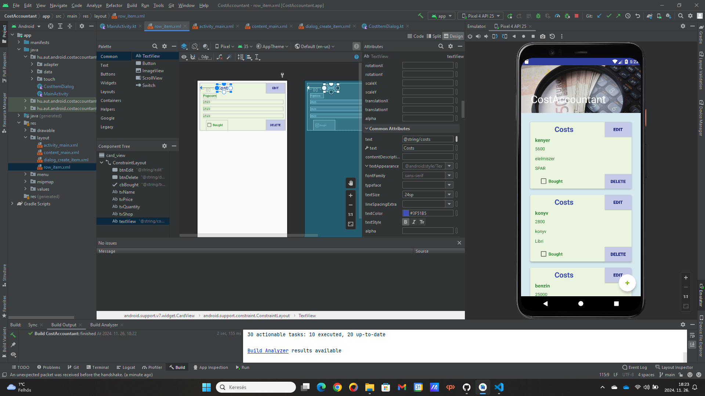
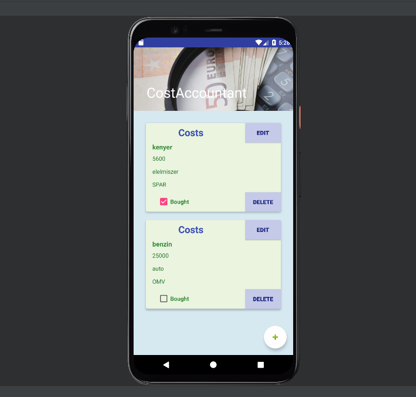

# KotlinShoppingList alkalmazás módosítása
***Kovács Gergely, mktjs0***

***III. évfolyam*** 

***Mérnökinformatikus, levelező***

---

1. [KotlinShoppingList alkalmazás módosítása](#kotlinshoppinglist-alkalmazás-módosítása)
   1. [Csomagnevek és tartalmazó mappa módosítása](#csomagnevek-és-tartalmazó-mappa-módosítása)
   2. [Háttérkép módosítása](#háttérkép-módosítása)
   3. [A háttér színének módosítása](#a-háttér-színének-módosítása)
   4. [Az új költségtípus hozzáadásánál a plain text szöveg megváltoztatása](#az-új-költségtípus-hozzáadásánál-a-plain-text-szöveg-megváltoztatása)
   5. [Adatbázis név és adattartalom módosítás](#adatbázis-név-és-adattartalom-módosítás)
   6. [Költséghozzáadó ikon változtatása](#költséghozzáadó-ikon-változtatása)
   7. [Költségtételt jelző címkék megváltoztatása](#költségtételt-jelző-címkék-megváltoztatása)

---

A dokumentáció Markdown fájlként készült el, így a GitHub repositoryban közvetlenül látható lesz. Készül belőle pdf változat is, amely szintén elérhető lesz a GitHub repository címén:

https://github.com/kovacsgergely22/mktjs0-mobile_dev.git

## Csomagnevek és tartalmazó mappa módosítása

Az alkalmazásban először a csomagneveket és a tartalmazó mappa nevét módosítottam, a KotlinShoppinglist alkalmazást átneveztem CostAccountant névre.

---

## Háttérkép módosítása

A következő lépés az alkalmazás felső részében található kép módosítása volt. Mivel költségnyilvántartó applikációra módosítok, így a következő képre esett a választásom (a kép a pixabay.com-ról származik, szabadon felhasználható).


A képet a következő helyre kellett bemásolni, hogy megtörténhessen a módosítás:

```
CostAccountant\app\src\main\res\drawable
```

A változtatást az activity_main.xml fájlban kellett végrehajtani. A folyamatot a következő kép szemlélteti:


---

## A háttér színének módosítása

A kép alatt található rész háttérszínét kékre változtattam, szintén az activity_main.xml fájlban, ahogy a következő ábra mutatja:


Ezzel a lehetőséggel az alapértelmezetten elérhető színek között választhatunk. Ezek közül egyik sem tetszett, ezért a színkeverő lehetőséget alkalmaztam.


---

## Az új költségtípus hozzáadásánál a plain text szöveg megváltoztatása

Az új kiadás bevitelére szolgáló plain textek alapértelmezett szövegét magyar nyelvűre változtattam, dőlt betűvel látható. Sorrendben a következők lettek:
* Termék neve - vásárlás értéke
* Ár
* Kategória
* Bolt



A kategória esetén a beviteli adattípust is változtatni kellett, mivel a Qantity helyett szerepel, a quantity adattípusa pedig decimal volt, ezt text-re kellett módosítani.



---

## Adatbázis név és adattartalom módosítás

Az átnevezés és az egyik adattípus megváltoztatása az adatbázist is érintette. Az adatbázis neve az AppDatabase-en belül shopping.db-ről costs.db-re válozott.
* ShoppingListDAO -> CostitemDAO
* ShoppingItem -> CostItem



---

## Költséghozzáadó ikon változtatása

Az ikont a levél ikonról "+" jelre változtattam.



---

## Költségtételt jelző címkék megváltoztatása

A változtatásokat a row_item.xml fájlban kell elvégezni. A feliratok szövege és címe mellett más lett a háttér és szövegek színe is.



Végül egy kép a működő, megváltozott alkalmazásról.



---
